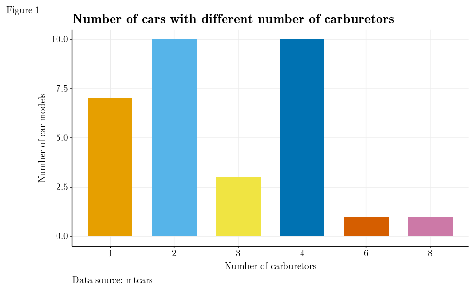

# ltxplot

This repo is an R package that creates a custom Latex-style ggplot theme with Latin Modern Roman font and a custom color palette. 

## Installation

In your R terminal, download the `ltxplot` package from github using `devtools`. 

`devtools::install_github('alicewchen/ltxplot')`

## How to use the package

There are two functions in this package.

`load_ltx_theme()` loads the custom Latin Modern Roman font and a custom color palette in your R environment. You only need to run this function once at the beginning of your working session. 

`theme_latex(font = "lmroman", base_size = 12)` is a ggplot complete theme. The default font size (`base_size`) is 12.   

Example:

```
library(ggplot2)
library(ltxplot)

load_theme_ltx()    #load custom font and color palette to current R environment

df <- mtcars
df$carb <- as.factor(df$carb)
ggplot(df, aes(x=carb, fill = carb))+
  geom_bar(stat= "count", width=0.7)+
  labs(title = 'Number of cars with different number of carburetors', 
       x = "Number of carburetors", 
       y = "Number of car models",
       tag = 'Figure 1',
       caption = "Data source: mtcars") +
  theme_latex(base_size = 14) +    #change to Latex-style theme
  theme(legend.position = "none")
```




